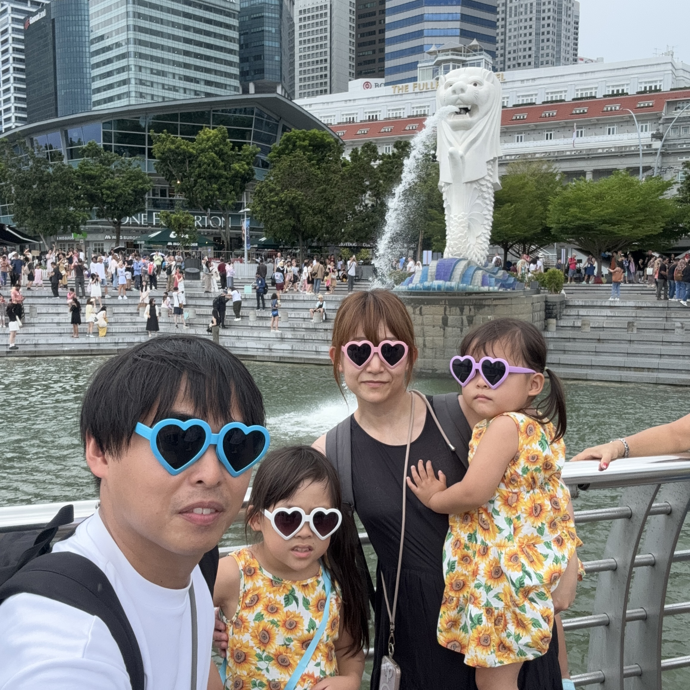
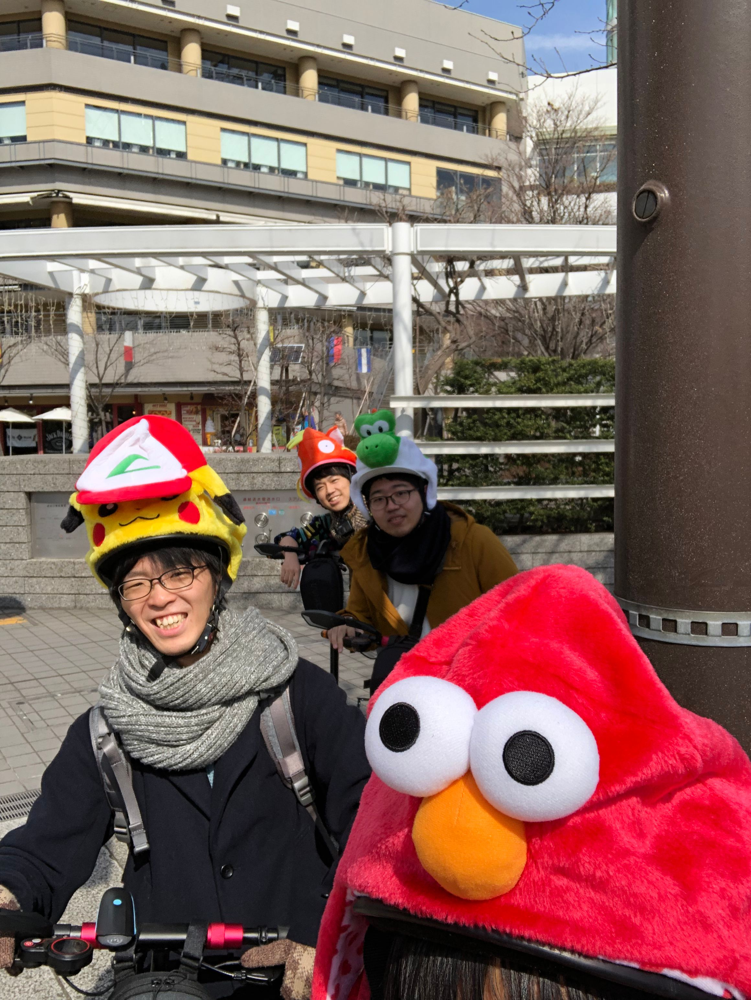
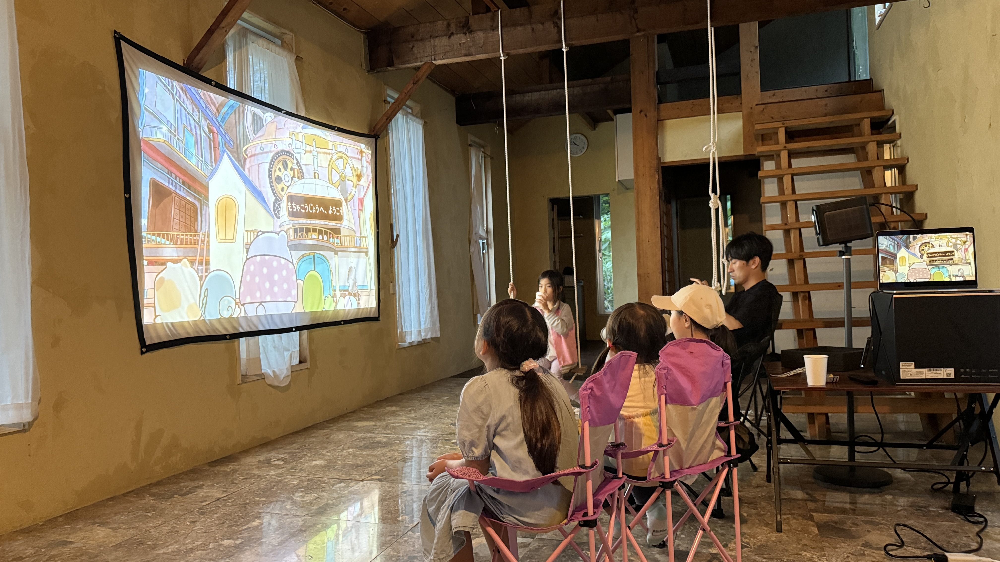

<!--
_color: white
-->

# 芸歴13年のエンジニアの生態

## 梶沼　翼

---

# [質問]

### エンジニアってどんなイメージですか?

---

# ・・・

---

### プリンターなおせる？
### システムつくれる?
### 水道管直せる？

---

---

# ゴール

- 多様なキャリアの1つの参考に。
- 良い出会いになれば。

---

# 今日はなすこと

- 私がどんな人か
- どんな仕事をしてるか
- メンターアピール

---

# 自己紹介

- 北海道出身、北海道在住
- 就職で東京、後に北海道にUターン
- 7年会社員・独立6年
- 7歳,4歳,妻の4人家族
- AI受託開発 / 電動キックボード販売 / あそびば開発

---

# 経歴

- 2012 年 VOYAGE GROUP(現: CALTA HOLDING)入社
- 2019 年 個人事業主独立
- 2020 年 SWALLOW 合同会社創業
- 2020 年 株式会社コクリ創業
- 2024 年 あそびば合同会社創業

---

# SWALLOW 合同会社

---
# 株式会社コクリ

---

# あそびば合同会社

---

#### 考え方変遷(就活→会社員→独立)

共通するのは安定志向

- 1 公務員→民間
- 2 地元就職 → 東京就職
- 3 コンサルタント →IT ベンチャー
- 4 ビジネス職 → エンジニア職
- 5 会社員 → 自営業
- 6 リスクヘッジ →リスク

---
# ここで水を飲む

#### (さりげなく時計を確認)

---

### いまエンジニアでどんな仕事してるか

- 社内専用ChatGPTの開発支援
- 製造業向け、原材料誤投入防止
- 社内の申請対応業務の自動対応
- メタボ阻止の行動変容のための画像生成AI

---

#### 何を大事にエンジニアしてるか

- なぜからはじめる
- 顧客からはじめる
- 小さくはじめる

---

#### 他のメンターと比較したちがい

- 独立して小さいチームで動いている
- 技術的 器用貧乏(広く浅く)
- いいね！と無責任にたくさん言う

---

## どんなお手伝いができるか

| STEP1              |     ◎STEP2     |             ◎STEP3 |
| :----------------- | :------------: | -----------------: |
| プログラミング◯ | プロダクト◯ | 事業・サービス◯ |

---

## 外国語に置き換えると

| STEP1        |         STEP2          |    STEP3 |
| :----------- | :--------------------: | -------: |
| 読み書き◯ | 日常会話◯| 仕事◯ |

---
### メンタリングイメージ
週１で６０分オンラインmtg

---

##### 芸歴13年目からのマウンティング

- 正しさを追い求めすぎない
- 努力は夢中にかなわない

---

<!--
_color: white
-->

# Thank You.

